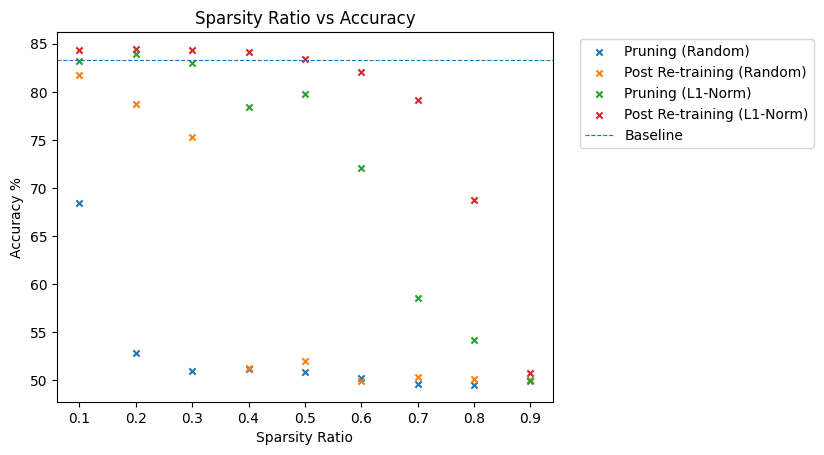
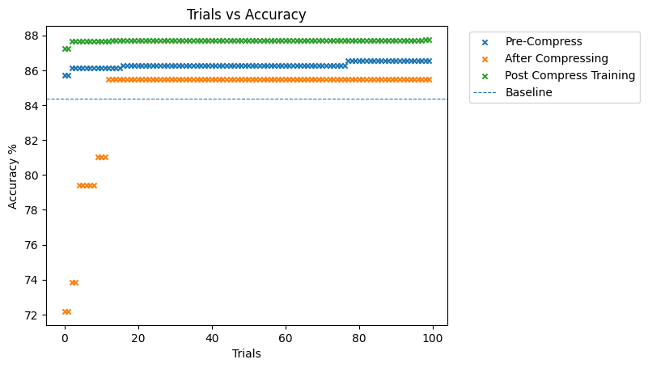

# Omar Alkhatib (oa321) Labs

CID: 02109422

## Lab 0

### Tutorial 1

> **Task**:
> Delete the call to `replace_all_uses_with` to verify that FX will report a `RuntimeError`.

Deleting the call to `replace_all_uses_with` did result in a runtime error. The error is shown below.


The problem is that the node still has users which depend on it, hence the node must be replaced with its parent explicitly before deleting.

### Tutorial 2

> **Task**: Remove the attention_mask and labels arguments from the hf_input_names list and re-run the following cell. Use mg.draw() to visualize the graph in each case. Can you see any changes in the graph topology? Can you explain why this happens?

The graphs are found in `tutorials/tutorial2/`. The differences between using all `hf_input_names` (Hugging Face Input Names) and removing attention or labels is the data flow which is captured by the `MaseGraph(...)` constructor. When the attention or labels are removed, the following portions of the graph are **not** included in the MG.

Attention Sub-graph        |  Labels Sub-graph
:-------------------------:|:-------------------------:
  |  

## Lab 1

<!-- ### Task 1.1a -->

<!-- Bit Width vs Maximum Accuracy on IMBD dataset. -->

<!--  -->

### Task 1

BitWidth vs Accuracy


### Task 1.2 (a & b)

The task specifies to choose your 'best model' however did not specify a criterion. The best model was chosen by minimising the derivative of the accuracy w.r.t to the width. The derivative was also weighted by the bitwidth to prioritise smaller width (for less memory footprint) and derivates with value 0 were excluded. Widths which attained a derivate of 0 occured either at very small widths or very large widths. This happened when no improvment happened between to consecutive tests. The criterion is not ideal and is prone to error, a more robust criterion could be implemented. This is done in ```mase/tasks/tutorial3/task1a.ipynb```.

The Plot below shows the performance of the model when applying pruning. The accuracy is measured after pruning but before retraining, and then measured again after training. The pruning strategies tested were Random Pruning and L1-Norm pruning.



## Lab 2

Lab 2 required completing Tutorial 5, which did not contain any tasks as far as im aware. The Tutorial introduced the hyper parameter search methadology.

## Task 2a

The task required exploring the effect of different samplers. Namely the Random, Grid and TPES samplers from ```optuna.samplers``` were tested. This was done by opening an Optuna study for each sampler and providing a callback function for each study. The callback function would store the accuracy of that trial and continue. The logfiles produced by the search are stored incase the parameters for each trial are needed. The checkpoint/baseline used for this task are

```
checkpoint = "prajjwal1/bert-tiny"
tokenizer_checkpoint = "bert-base-uncased"
```

The plot below shows the results for each sampler.


## Task 2b

The goal is to analyse the effect of compressing the network on the accuracy of the model. The task states to select the best model out of the those in task 1. The model with the highg accuracy was obtained by the random sampler. However I tested both the random sampler and the TPESampler for this run. It is possible that the random sampler got lucky with a parameterisation. This seen below, hence the TPESampler out performs the random sampler when taking into account the compression pipeline.


Random Sampler        | TPESampler
:-------------------------:|:-------------------------:
  |  


