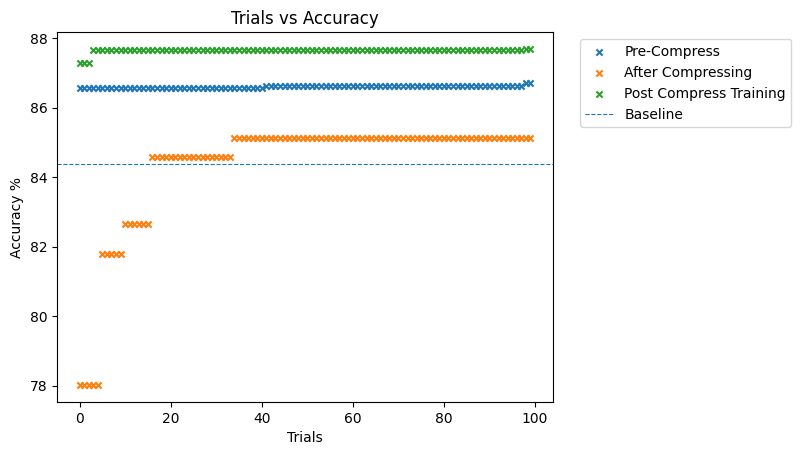

# Omar Alkhatib (oa321) Labs

CID: 02109422

## Lab 0

### Tutorial 1

> **Task**:
> Delete the call to `replace_all_uses_with` to verify that FX will report a `RuntimeError`.

Deleting the call to `replace_all_uses_with` did result in a runtime error. The error is shown below.


The problem is that the node still has users which depend on it, hence the node must be replaced with its parent explicitly before deleting.

### Tutorial 2

> **Task**: Remove the attention_mask and labels arguments from the hf_input_names list and re-run the following cell. Use mg.draw() to visualize the graph in each case. Can you see any changes in the graph topology? Can you explain why this happens?

The graphs are found in `tutorials/tutorial2/`. The differences between using all `hf_input_names` (Hugging Face Input Names) and removing attention or labels is the data flow which is captured by the `MaseGraph(...)` constructor. When the attention or labels are removed, the following portions of the graph are **not** included in the MG.

Attention Sub-graph        |  Labels Sub-graph
:-------------------------:|:-------------------------:
  |  

## Lab 1

<!-- ### Task 1.1a -->

<!-- Bit Width vs Maximum Accuracy on IMBD dataset. -->

<!--  -->

### Task 1a

BitWidth vs Maximum Accuracy So far


### Task 1b

BitWidth vs Accuracy


### Task 1.2 a

The task specifies to choose your 'best model' however did not specify a criterion. The best model was chosen by minimising the derivative of the accuracy w.r.t to the width. The derivative was also weighted by the bitwidth to prioritise smaller width (for less memory footprint) and derivates with value 0 were excluded. Widths which attained a derivate of 0 occured either at very small widths or very large widths. This happened when no improvment happened between to consecutive tests. The criterion is not ideal and is prone to error, a more robust criterion could be implemented. This is done in ```mase/tasks/tutorial3/task1a.ipynb```.

The Plot below shows the maximum achieved accuracy against the sparsity for each strategy.


### Task 1.2 b

The Plot below shows the performance of the model when applying pruning. The accuracy is measured after pruning but before retraining, and then measured again after training. The pruning strategies tested were Random Pruning and L1-Norm pruning.

L1 Pruning        | Random Pruning
:-------------------------:|:-------------------------:
  |  


## Lab 2

Lab 2 required completing Tutorial 5, which did not contain any tasks as far as im aware. The Tutorial introduced the hyper parameter search methadology.

## Task 2a

The task required exploring the effect of different samplers. Namely the Random, Grid and TPES samplers from ```optuna.samplers``` were tested. This was done by opening an Optuna study for each sampler and providing a callback function for each study. The callback function would store the accuracy of that trial and continue. The logfiles produced by the search are stored incase the parameters for each trial are needed. The checkpoint/baseline used for this task are

```
checkpoint = "prajjwal1/bert-tiny"
tokenizer_checkpoint = "bert-base-uncased"
```

The plot below shows the results for each sampler.


## Task 2b

The goal is to analyse the effect of compressing the network on the accuracy of the model. The task states to select the best model out of the those in task 1. The model with the highg accuracy was obtained by the random sampler. However I tested both the random sampler and the TPESampler for this run. It is possible that the random sampler got lucky with a parameterisation. This seen below, hence the TPESampler out performs the random sampler when taking into account the compression pipeline.

I also ran it with Random and TPESampler, this was done to see if random selection may possibly find a novel configuration which is better than the TPE Samplers approach. However as expected this is highly unlikley due to the size of the search space, hence the TPE Sampler outperforms the Random Sampler.

### Random Sampler



### TPESampler


## Lab 3

The coe was modified to allow for integer layesr to have the bit-widths ([8, 16, 32]) and fractional widths ([2, 4, 8]). The search was run again using Random and TPESampler. Below is the maximum achieved acacuracy over 100 trials.

### Task 1

### Random Sampler (Lab 3)


### TPESampler (Lab 3)


### Task 2

The seach space was then extended to include all the supported layers. The plot below shows the accuracy over the number of trials when all layers are included in the search space.

Note that some layers were excluded due to being incomplete/broken. Namely, we exclude Minifloat Block, and we set all '*bipolar' options to `True`. Setting them to  `False` caused the search to break.

### TPESampler (Lab 3 Task 2)


### Random Sampler (Lab 3 Task 2)


Again as expected, the TPESampler outperforms random sampling of the search space.

Furthermore, the task required to explore the effect of each quantisation indiivudally. To that end, 8 seperate runs were done where the search space was `torch.nn.Linear` and one other layer. The results of all 8 runs are plotted below.


## Lab 4 (HW Stream)

### Task 1: Differnce between SW and HW Metadata

Both passes are used to annotate the MaseGraph of the Network. The main difference between the two passes is the meta data they attach onto each node.

For software, the data attached on to each node is related to software execution, such as data flow dependencies, execution order, and optimization flags for compilers. Hardware metadata is used to add information about the mapping of the network onto HW. Such data includes the verilog parameter of the layers, the toolchain to use (HLS, RTL etc.), the name of the module, and interface parameters for the layer.

The interface is a dictionay which has the `name` string against parameters. Furthermore, the HW metadata pass created a dependency chain which maps the node to the files required for module generation.

### Task 2: Explanation of ```top.sv```

```sv
timescale 1ns/1ps
module top #(
    parameter fc1_DATA_IN_0_PRECISION_0 = 8,
    parameter fc1_DATA_IN_0_PRECISION_1 = 3,
    parameter fc1_DATA_IN_0_TENSOR_SIZE_DIM_0 = 4,
    parameter fc1_DATA_IN_0_PARALLELISM_DIM_0 = 4,
    parameter fc1_DATA_IN_0_TENSOR_SIZE_DIM_1 = 1,
    parameter fc1_DATA_IN_0_PARALLELISM_DIM_1 = 1,
    ...
    parameter DATA_IN_0_PRECISION_0 = 8,
    parameter DATA_IN_0_PRECISION_1 = 3,
    parameter DATA_IN_0_TENSOR_SIZE_DIM_0 = 8,
    parameter DATA_IN_0_PARALLELISM_DIM_0 = 4,
    parameter DATA_IN_0_TENSOR_SIZE_DIM_1 = 1,
    parameter DATA_IN_0_PARALLELISM_DIM_1 = 1,
    parameter DATA_OUT_0_PRECISION_0 = 8,
    parameter DATA_OUT_0_PRECISION_1 = 3,
    parameter DATA_OUT_0_TENSOR_SIZE_DIM_0 = 8,
    parameter DATA_OUT_0_PARALLELISM_DIM_0 = 4,
    parameter DATA_OUT_0_TENSOR_SIZE_DIM_1 = 1,
    parameter DATA_OUT_0_PARALLELISM_DIM_1 = 1
)
```

First the timescale is set to 1ns/1ps. This is the scale used to caluclate time. Hence 1ps on the simulator cycle maps to 1ns in real time. Lines 9 - 57 are parameters to the generated module. The module parameters are generated based on the hardware meta data. The types of parameters are dicussed below.

Parallelism Paramters: Dictate how much a module is 'folded'. Higher parallelism used more resources, and improves throughput. Lower parallelism uses less resources and may cause more backpressure (One can use fifos on the input when folding, but this increases resources again).

There are precision parameteers that are used to dictate data type. There are Dimension parameters to indicate the sized of matrix-vector operations, and finally some custom parameters for activation functions such as `relu_INPLACE`.

```sv
(
    input clk,
    input rst,

    input  [DATA_IN_0_PRECISION_0-1:0] data_in_0 [DATA_IN_0_PARALLELISM_DIM_0*DATA_IN_0_PARALLELISM_DIM_1-1:0],
    input  data_in_0_valid,
    output data_in_0_ready,
    output  [DATA_OUT_0_PRECISION_0-1:0] data_out_0 [DATA_OUT_0_PARALLELISM_DIM_0*DATA_OUT_0_PARALLELISM_DIM_1-1:0],
    output  data_out_0_valid,
    input data_out_0_ready
);
```

The interface of the module is an Axi Stream compatible interface. Lines 73 - 93 are signal instantiations used to connect the components instantiated together.

There are 4 components instantiated in the module.

- fc1_inst
- fc1_weight_source_0
- fc1_bias_source_0
- relu_inst

The fc1 is a fixed linear layer which reads in data from the exposed input pins (data_in_0 -> fc_0). It also takes in the output of the weigtht source and bias source. It implements a fixed linear layer, computing `Wx + b`.

The output of the linear layer is found in the signal fc1_data_out_0, which is fed into the fixed relu instance. The relu computed the element wise activation function and outputs the data to the top level pin `data_out_0`.

### Task 3: Simulation output

The output of the simulation is shown below.


### Extension Task: Implementing SoftSign()

### Extension Task: Implementing Softshrink()

### Extension Task: Implementing Tanh()

### Extension Task: Implementing Tanhshrink()
