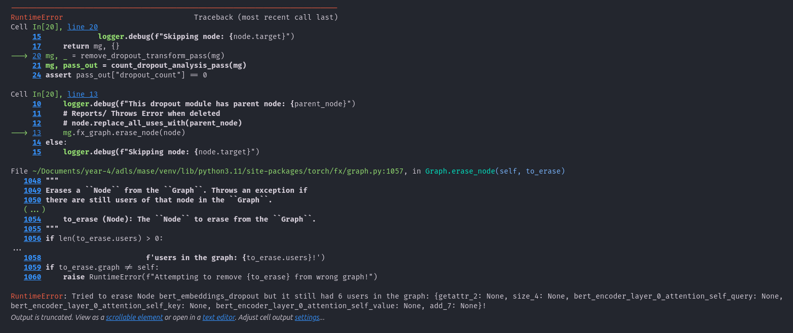
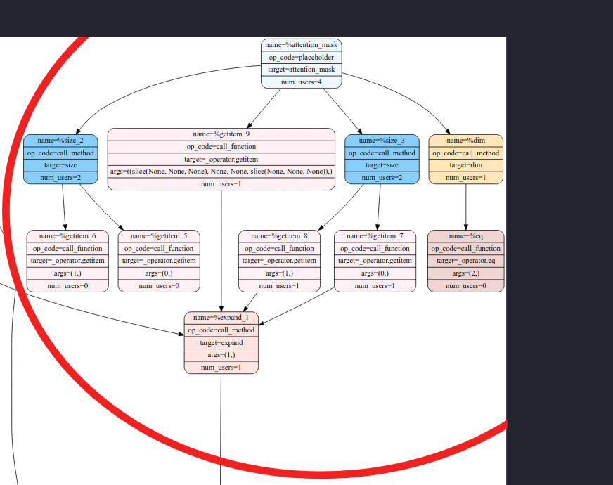
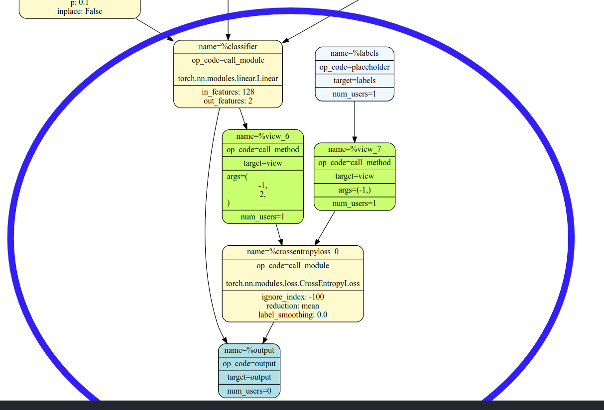

# Omar Alkhatib (oa321) Labs

CID: 02109422

## Lab 0

### Tutorial 1

> **Task**:
> Delete the call to `replace_all_uses_with` to verify that FX will report a `RuntimeError`.

Deleting the call to `replace_all_uses_with` did result in a runtime error. The error is shown below.

The problem is that the node still has users which depend on it, hence the node must be replaced with its parent explicitly before deleting.

### Tutorial 2

> **Task**: Remove the attention_mask and labels arguments from the hf_input_names list and re-run the following cell. Use mg.draw() to visualize the graph in each case. Can you see any changes in the graph topology? Can you explain why this happens?

The graphs are found in `tutorials/tutorial2/`. The differences between using all `hf_input_names` (Hugging Face Input Names) and removing attention or labels is the data flow which is captured by the `MaseGraph(...)` constructor. When the attention or labels are removed, the following portions of the graph are **not** included in the MG.

Attention Sub-graph        |  Labels Sub-graph
:-------------------------:|:-------------------------:
  |  
